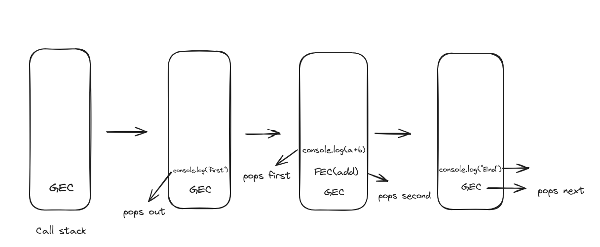
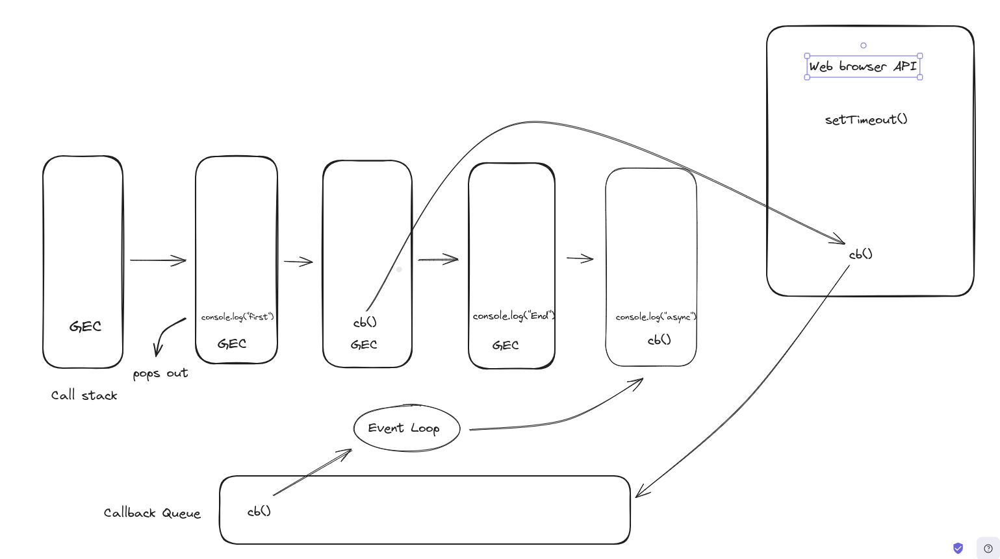
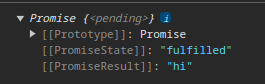
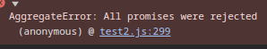

# Asynchronous JavaScript

JavaScript is a single-threaded synchronous language. It allows only a single task to be executed at a time. To solve this issue, asynchronous JavaScript comes into play. Asynchronous JavaScript allows you to perform tasks without blocking the main thread.

## Call stack

Before entering the asynchronous Javascript, we must know how the JavaScript engine works. The Call stack is the main thread in the JavaScript Engine.


```javascript
function add(a,b){
    console.log(a+b)
}
console.log('Start')
add(4,5)
console.log("End")
```
Consider the following code snippet, when JavaScript Engine starts executing, it creates a global Execution Context(GEC) inside the call stack.



- GEC pops up the console.log("First") and executes
- Then GEC pops up the add function, and the function creates its own execution context(FEC).
- The add function pops up the console.log
- Finally the GEC pops the console.log("end) and executes.

This is a synchronous way of execution in the call stack.


## Asynchronous Code

Synchronous Code can be converted to Asynchronous Code using three methods
- Using Callback functions
- Using Promises
- Using Async/Await

## Asynchronous Code with Callback

Consider the following code snippet.

```javascript
console.log('Start')
setTimeout(function cb(){
    console.log("async")
},0)
console.log("End")
```
We use a web browser API to make the callback function inside setTimeout work asynchronous.

### Web Browser API

JavaScript engine doesn't have a lot of function, so it takes from the browser's API.

These are some list of browser's API
 - console
 - setTimeout()
 - fetch()
and so on.

Going back to the code, we used a setTimeout which is a web browser API, setTimeout gets a callback function which makes it an asynchronous code.



How does the async code execute in the above code snippet?

- First, the GEC goes into the call stack
- Next the console.log("Start") pops and executes.
- The setTimeout moves on to the browser's API and starts the timer.
- The console.log("End") pops out as well as the GEC.
- After completion of the timer the cb function moves to a special place called **Callback Queue**
- The event loop checks for the call stack, if it is empty the cb moves on to the callback queue.

### Event loop

The Event loop is responsible for moving the asynchronous code into the call stack from the callback queue or microtask queue if the call stack is empty.

**MicroTask Queue**

- It has a higher priority over the callback queue.
- fetch(), promises come into the microtask queue.

**Callback Queue**
- Receives normal that comes out from setTimeout and so on.


Consider the following code snippet.

```javascript
setTimeout(function cb(){
    console.log("Callback Queue")
},0)
Promise.resolve().then(()=>console.log("Microtask Queue"))
```
Output:

```bash
Microtask Queue
Callback Queue
```
Since the microtask queue has the higher priority, the microtask executes first.

### Issues using callback in asynchronous code


#### 1. Callback Hell

Sometimes we need to execute a code based on previous asynchronous code. That's where the callback hell exists.

```javascript
asyncFunction1(args, function() {
    asyncFunction2(args, function() {
        asyncFunction2(args, function() {
           doSomething()
        });
    });
});
```

In the about code the asyncFunction2 expects the result of asyncFunction1 and so on. It creates a **pyramid of doom**.

#### 2. Inversion of control

Consider a scenario in an E-commerce store, where the user needs to pick an item and create an order, followed by payment.

```javascript
function proceedToPayment(orderId){
    console.log("Payment done")
}
function createOrder(cb){
    const orderId=123
    cb(orderId)
}
createOrder((orderId)=>{
    proceedToPayment(orderId)
})
```
The above code snippet creates order and proceeds to payment, but the issue is we are passing the payment gateway to the create order function. What if the createOrder creates an orderId twice?

```javascript
function createOrder(cb){
    const orderId=123
    cb(orderId)
    cb(orderId)
}
```
The user needs to pay the amount twice. We are blindly trusting the createOrder with the important piece of code. This is the major issue called **Inversion of control**.

## Promises

Promises are objects that represent the completion or failure of the asynchronous tasks. Promise was created to solve the callback hell as well as the Inversion of control.

It has three states

- Pending
- fulfilled
- rejected  

### Creating a promise

Syntax:

```javascript
const promise=new Promise((resolve,reject)=>{
    if(success){
        resolve(value)
    }
    else{
        reject(error)
    }
})
```

Promise takes two parameters resolve and reject. If the async operation is successful then it is resolved or else it will get rejected.

**Pending state**

When the promise takes time to settle, it is in a pending state.

```javascript
const promise=new Promise((resolve,reject)=>{
   setTimeout(()=>{
    resolve()
   })
})
console.log(promise)
```

The above code executes and the result is 



We can't consume the promise with the synchronous nature of code.

### Consuming the promise

1. `then`

    JavaScript provides a special keyword `then` to consume the promise if it is resolved. The `then` keyword uses a callback function to store the result of a promise.

     ```javascript
    const promise = new Promise((resolve, reject) => {
        setTimeout(() => {
            resolve("hi");
        });
    })

    promise.then((value) => {
        console.log(value);
    }); // hi
    ```
    The `then` keyword is used only for the resolved promise. If the promise is resolved, the resultant data is passed to the callback function.

2. `catch`

    Javascript uses `catch` to handle the error or exceptions.

    ```javascript
    const promise = new Promise((resolve, reject) => {
        setTimeout(() => {
            reject("error");
        });
    })

    promise.catch((value) => {
        console.log(value);
    }); // error
    ```
3. `finally`

    The `finally` block executes no matter what happens to the promise.

    ```javascript
    promise
        .then((value) => {
            console.log(value);
        }).catch((err)=>{
            console.log(err)
        }).finally(()=>{
            console.log("I will run for sure")
        })
    ```
    It's mainly used for **cleanup process**.

### Promise Chaining

Promise chaining is the most important feature which solves the two problems using asynchronous callback.

```javascript
createOrder(cart)
    .then((orderId) => {
        return processToPayment(orderId)
    })
    .then((orderId) => {
        return orderSummary(orderId)
    })
    .catch((err)=>{
        console.log("Order failed")
    })
    .finally(()=>{
        cleanUp()
    })
```

The above code avoids the **callback hell** by making the code grow vertically.

Also, we are not giving control of the payment to the createOrder function. This solves the **inversion of control**
problem.

### Methods in promise

There are various methods based on the use cases.

1. `Promise.all()`

    It takes an array with promises and resolves into an array with the resolved value of each promise.

    ```javascript
    const promise1 = new Promise((resolve, reject) => {
        resolve(1)
    })

    const promise2 = new Promise((resolve, reject) => {
        resolve(2)
    })

    Promise.all([promise1, promise2])
        .then((res) => {
            console.log(res)
        })
    //output : [1,2]
    ```
    This is the simplest example for `Promise.all()`

    What if promise1 takes 3 secs to execute?

    ```javascript

    const promise1 = new Promise((resolve, reject) => {
        resolve(1)
    })

    const promise2 = new Promise((resolve, reject) => {
        setTimeout(()=>{
            resolve(2)
        },3000)
    })

    Promise.all([promise1, promise2])
        .then((res) => {
            console.log(res)
        })

    //output: [1,2] after 3 seconds.
    ```

    The result is displayed after 3 seconds.

    **Errors in `Promise.all()`**

    - It returns the error from the rejected promise.

    ```javascript
    const promise1 = new Promise((resolve, reject) => {
        resolve(1)
    })

    const promise2 = new Promise((resolve, reject) => {
        setTimeout(()=>{
            reject("Error in second promise")
        },3000)
    })

    Promise.all([promise1, promise2])
        .then((res) => {
            console.log(res)
        }).catch((err)=>{
            console.error(err)
        })
    // output : Error in second promise
    // Time taken : 3 seconds
    ```
2. `Promise.any`

    Returns the first promise to get resolved.

    ```javascript
    const promise1 = new Promise((resolve, reject) => {
        resolve(1)
    })

    const promise2 = new Promise((resolve, reject) => {
        setTimeout(()=>{
            reject("Error in second promise")
        },3000)
    })

    Promise.any([promise1, promise2])
        .then((res) => {
            console.log(res)
        }).catch((err)=>{
            console.error(err)
        })
    //output : 1
    ```

    What if all the promise gets rejected?

    ```javascript
    const promise1 = new Promise((resolve, reject) => {
        reject(1)
    })

    const promise2 = new Promise((resolve, reject) => {
        setTimeout(()=>{
            reject("Error in second promise")
        },3000)
    })

    Promise.any([promise1, promise2])
        .then((res) => {
            console.log(res)
        }).catch((err)=>{
            console.error(err)
        })
    ```

    It throws an aggregated error(graceful error) which has the reason for the errors in an array.

    

3. `Promise.allSettled`

    Returns an array of values, promiseState of the promises.

    ```javascript
    const promise1 = new Promise((resolve, reject) => {
        reject(1)
    })

    const promise2 = new Promise((resolve, reject) => {
        setTimeout(()=>{
            reject("Error in the second promise")
        },3000)
    })

    Promise.allSettled([promise1, promise2]).
        then((res) => {
            console.log(res)
        }).catch((err)=>{
            console.error(err)
        })
    // output :
    // [
    // { status: 'fulfilled', value: 1 },
    // { status: 'rejected', reason: 'Error in the second promise' }
    // ]
    ```

    It doesn't throw any errors.

4. `Promise.race`

    Return the value of the first promise to get resolved or rejected.

    ```javascript
    const promise1 = new Promise((resolve, reject) => {
        setTimeout(()=>{
            resolve(1)
        },3001)
    })

    const promise2 = new Promise((resolve, reject) => {
        setTimeout(()=>{
            reject("Error in second promise")
        },3000)
    })

    Promise.race([promise1, promise2]).
        then((res) => {
            console.log(res)
        }).catch((err)=>{
            console.error(err)
        })
    //Output : Error in second promise
    ```

    The second promise got rejected before the first promise, that's how the Promise.race() works.

## Async Await

Async await is the modern and easiest way to handle promises. Async/await is a **syntactic sugar** built on top of Promises to make it easier to work with asynchronous code.

### async Functions

The difference between the normal function and the async function is **async function always returns a promise**.

```javascript
async function doSomething(){
    return "something"
}
doSomething()
//output : Promise{"something"}
```
If the return value is not a promise, then it will wrap the value with a promise.

### `await`

`await` can be used only in **async functions**. It is used to get the resolved value of a promise.

```javascript
async function doSomething(){
    const promise1=new Promise((resolve,reject)=>{
        setTimeout(()=>{
            resolve("executed ")
        },3000)
    })
    const data = await promise1
    console.log(data)
}

doSomething()

// output : executed 
// Time taken : 3 seconds
```

It is similar to the `.then()` to get the result but the syntax is much readable and easier. Also, the async function doesn't block the main thread.

### Understanding CallStack with async await()

```javascript
async function doSomething() {
    console.log("hi")
    const promise1 = new Promise((resolve, reject) => {
        setTimeout(() => {
            resolve("executed");
        }, 3000);
    });
    const data = await promise1;
    console.log(data);
}

function sync() {
    console.log("sync")
}
doSomething();
sync()
// output : hi sync executed
```
- doSomething() is pushed on the call stack.
- pops console.log("hi") and executes.
- The promise is not resolved, the doSomething() pops out.
- sync() is pushed on callStack and executed.
- After 3 second the doSomething() pushes in.
- It executes and logs the data.

### Error handling in async await

Error handling in async await is done using the try-catch block.

```javascript
async function doSomething() {
    console.log("hi")
    const promise1 = new Promise((resolve, reject) => {
        resolve("resolved");
    });
    try {
        const data = await promise1;
        console.log(data);
    }
    catch (err) {
        console.error(err)
    }
}
```

- try block executes if it is resolved.
- catch block executes if the promise gets rejected.

## Conclusion

Asynchronous JavaScript is crucial for building efficient and responsive web applications.

Key Points:
- **Single-Threaded Nature**: JavaScript operates on a single thread, making asynchronous programming essential for non-blocking operations.

- **Call Stack and Event Loop**: The call stack executes functions, while the event loop manages asynchronous tasks, moving them from the callback queue or the microtask queue to the call stack.

- **Callbacks**: Fundamental to async operations 

- **Promises**: Solves the callback hell and inversion of control.

- **Async/Await**: Syntactic sugar over promises that make asynchronous code look and behave like synchronous code, simplifying readability and error handling.

