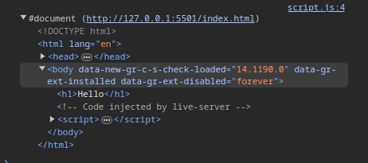

# The Document Object Model (DOM): A Technical Overview

 DOM provides a structured representation of a web page, enabling scripts to access and manipulate content, structure, and styles. The DOM is an essential tool for creating dynamic and interactive web applications.

## DOM Structure

The DOM represents an HTML document as a tree structure.


## Document Object

The document object has access to all other nodes. It is the root element of the HTML document.
```javascript
console.log(document)
```



The document object consists of the whole HTML document.

## Accessing DOM Elements 

Accessing DOM elements is a fundamental part of working with the DOM in JavaScript

### 1. `getElementById`
- Retrieves an element by its id attribute. 
- `getElementById` returns a single element.

```javascript
const header = document.getElementById('header');
console.log(header);  
```

### 2. `getElementsByClassName`

- returns a HTMLCollection of all elements with a given class name.

```javascript
const items = document.getElementsByClassName('item');
console.log(items);
```

### 3. `getElementsByTagName`

- returns a live HTMLCollection of all elements with a given tag name, such as `div`, `p`, or `a`.

```javascript
const paragraphs = document.getElementsByTagName('p');
console.log(paragraphs);
```

### 4. `querySelector`

- returns the first element that matches a specified CSS selector.

```javascript
const mainHeader = document.querySelector('header.main-header');
console.log(mainHeader);  
```

### 5. `querySelectorAll`

- returns a  NodeList of all elements that match a specified CSS selector.

```javascript
const listItems = document.querySelectorAll('ul li');
console.log(listItems); 
```

## Modifying Content

### 1. `setAttribute()`, `getAttribute()`, `removeAttribute()`

- The `setAttribute()` method allows you to add or modify the attributes of an HTML element. 

- The `getAttributes()` method allows you to get the value of a specific attribute.

- The `removeAttribute()` method allows you to remove a specific attribute.

```javascript
const image = document.getElementById('image');
image.setAttribute('src', 'new-image.jpg');

image.getAttribute('src');

image.removeAttribute('src');
```

### 2. `innerHTML`, `innerText`, `textContent`

- The `innerHTML` property allows you to set the HTML content of an element. 

- The `innerText` property sets the text content of an element. It respects CSS styling, meaning hidden text will not be included.

- The `textContent` property sets the text content of an element, including hidden text. 

```javascript
// Usage : innerHTML
const container = document.getElementById('container');
container.innerHTML = '<p>This is a new paragraph.</p';
```

Consider the following code snippet where some text is hidden.

```html
<div id="example2">
    <p>This is visible text.</p>
    <p style="display: none;">This text is hidden.</p>
</div>
```
**Using `innerText` :** 
```javascript
const example2 = document.getElementById('example2');
console.log(example2.innerText);

// Output: "This is visible text."
```

**Using `textContent` :**

```javascript
const example2 = document.getElementById('example2');
console.log(example2.textContent);

// Output: "This is visible text.This text is hidden."
```

### 3. `classList`

- The classList property allows you to add, remove, or toggle classes on an element. 
- This is particularly useful for applying CSS styles dynamically.

```javascript
const button = document.getElementById('button');

// Add a class
button.classList.add('active');      

//Remove a class
button.classList.remove('inactive'); 

// Toggle a class
button.classList.toggle('dark'); 
```
### 3. `style`

- The style property allows you to directly modify the inline CSS styles of an element.

```javascript
const box = document.getElementById('box');
box.style.backgroundColor = 'blue';
```
## Traversing the DOM

Traversing the DOM means navigating between different elements, nodes, and text within the Document Object Model (DOM). 

### 1. Parent and Child Elements : 

- `parentElement`: Retrieves the parent element of the current element.
- `children`: Returns a  NodeList of all child elements of an element.

Example :
```html
<div id="parent">
    <p id="child1">Child 1</p>
    <p id="child2">Child 2</p>
</div>
```

```javascript
const child1 = document.getElementById('child1');
console.log(child1.parentElement); 
// Prints the <div> element 

const parent = document.getElementById('parent');
console.log(parent.children); 
// Prints a NodeList containing the two <p> elements
```

### 2. First and Last Child

- `firstElementChild`: Retrieves the first child node of an element.
- `lastElementChild`: Retrieves the last child node of an element.

```javascript
console.log(parent.firstElementChild); 
// Prints the first child node 
console.log(parent.lastElementChild);  
// Prints the last child node 
```

### 3. Siblings

- `nextElementSibling`: Retrieves the next sibling of the current element.
- `previousElementSibling`: Retrieves the previous sibling of the current element.

```javascript
console.log(child1.nextElementSibling); 
// Prints the <p> element with id="child2"
console.log(child2.previousElementSibling); 
// Logs the text node or the <p> element with id="child1"
```
### 4. Closest Ancestor

- `closest()`: Returns the closest ancestor of the current element or the element itself that matches a specified selector.

```javascript
const child = document.getElementById('child1');
const closestDiv = child.closest('div');
console.log(closestDiv); 
```

## Creating and Adding Elements

The document object allows you to create new elements dynamically and add them to the DOM.

- `createElement`: Creates a new element.
- `createTextNode`: Creates a new text node.
- `appendChild`: Appends a child element to a parent element.

```javascript
const newDiv = document.createElement('div');
const newText = document.createTextNode('Hello, World!');
newDiv.appendChild(newText);
document.body.appendChild(newDiv);
```

## Event listeners

Event listeners in JavaScript allow you to run specific code in response to user interactions like clicks, key presses, mouse movements, and more.

### 1. Attaching and removing Event Listeners

To attach an event listener to a DOM element, you use the addEventListener method. The basic syntax is:

```javascript
element.addEventListener(event, callback, option);
```

- `event`: The type of event to listen for, such as 'click', 'mouseover', 'keydown', etc.
- `callback`: The function that will be executed when the event occurs.
- **options** : An object consists of four methods.
    - `capture` : used to do stuffs in capturing phase.
    - `once` : callback function is called only once.
    - `passive` : not to call preventDefault() method.
    - `signal` : used to abort api call.

Example: 

```javascript
const button = document.getElementById('myButton');

button.addEventListener('click', function() {
    alert('Button was clicked!');
});
```

To remove an event listener

```javascript
function showAlert() {
    alert('Button was clicked!');
}
button.addEventListener('click', showAlert);

button.removeEventListener('click', showAlert);
```

Always remember not to use a anonymous function in the event listener. It doesn't remove the correct event listener.

### 2. Event object

When an event occurs, an event object is automatically passed to the event handler function. This object contains information about the event, such as the target element, the type of event, and more.

```javascript
button.addEventListener('click', function(event) {
    console.log('Event type:', event.type); // 'click'
    console.log('Clicked element:', event.target.value); 
    // Returns the value of the button
});
```
### 3. Event bubbling and event capturing

- When an event occurs on an element (like a click), it doesn't only trigger on that element but also on its ancestors.

- This behavior is due to event propagation, which occurs in three phases: 
    - Event capturing 
    - Target
    - Event bubbling.


#### Event bubbling :

In event bubbling, the event starts at the target element and then "bubbles" up through its ancestors until it reaches the root of the DOM tree.

Here's an example demonstrating bubbling:

```html
<div id="outer">
    <div id="inner">
        <button id="button">Click Me</button>
    </div>
</div>
```

```javascript
const outerDiv = document.getElementById('outer');
const innerDiv = document.getElementById('inner');
const button = document.getElementById('button');

outerDiv.addEventListener('click', () => {
    console.log('Outer Div Clicked');
});

innerDiv.addEventListener('click', () => {
    console.log('Inner Div Clicked');
});

button.addEventListener('click', () => {
    console.log('Button Clicked');
});
```

When we click the button the output will be

```mathematica
Button Clicked
Inner Div Clicked
Outer Div Clicked
```

#### Event capturing :

Event capturing is the opposite of bubbling. The event starts at the outermost element and propagates down to the target element.

```javascript
outerDiv.addEventListener('click', () => {
    console.log('Outer Div Clicked');
}, true);

innerDiv.addEventListener('click', () => {
    console.log('Inner Div Clicked');
}, true);

button.addEventListener('click', () => {
    console.log('Button Clicked');
}, true);
```

If you click the button with capturing enabled, the output will be:

```mathematica
Outer Div Clicked
Inner Div Clicked
Button Clicked
```

#### `stopPropagation` :

You can stop the event from propagating either during bubbling or capturing by using the stopPropagation() method.

```javascript
button.addEventListener('click', (event) => {
    event.stopPropagation();
    console.log('Button Clicked');
});
```

Now, when you click the button, only the Button Clicked message will be logged.

#### `stopImmediatePropagation` :

The `stopImmediatePropagation()` method is similar to stopPropagation(), but it prevents not only further propagation of the event but also prevents other event listeners of the same event from being called.

Example: 

```html
<button id="btn">Click Me</button>
```

```javascript
const btn = document.getElementById('btn');

// First event listener
btn.addEventListener('click', (event) => {
  console.log('First listener');
  event.stopImmediatePropagation(); 
  // Stops other listeners on the same element
});

// Second event listener
btn.addEventListener('click', () => {
  console.log('Second listener'); 
  // This will never be executed
});
```

When you click the button, the output will be:

```mathematica
First listener
```

### 4. Event delegation

**Event delegation** is a technique in JavaScript where instead of adding event listeners to individual child elements, you add a single event listener to a parent element.

**Example of Event Delegation:**

```html
<ul id="menu">
  <li>Item 1</li>
  <li>Item 2</li>
  <li>Item 3</li>
</ul>
```

Instead of adding event listeners to each `<li>` element, you can add one to the parent `<ul>` element:

```javascript
const menu = document.getElementById('menu');

menu.addEventListener('click', (event) => {
  // Check if the target is an 'li' element
  if (event.target.tagName === 'LI') {
    console.log(`You clicked on ${event.target.innerText}`);
  }
});
```
## Conclusion

The Document Object Model is fundamental to web development, providing a structured interface to interact with and manipulate web documents. Understanding the DOM's structure, methods, events, and best practices is crucial for developing efficient, interactive, and secure web applications.