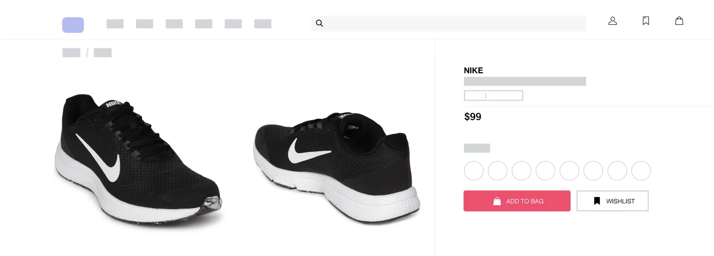

# Content Delivery Network (CDN)

- CDN is a network of interconnected servers explicitly used to cache the content from the origin server.  

- The primary aim of a CDN is to improve the performance, reliability, and security of web content delivery by serving data from servers that are physically closer to the end-users.

## Scenario

  - Consider a website where users from multiple countries access contents from a server.
      
      

    

  - **Issues :**
       
    Observing this image you may have noticed that the users from a long distance may have a high response time getting their content.

## How does CDN work?
   

   - CDN servers are implemented in different destinations where people can access the cached contents.

   - Those CDN servers are connected to the origin server.

     

   - **User Requests**
      - When a user requests content, it checks in the nearby CDN servers.
   - **Cache Check**
      - The CDN server checks if it has the content in its cache.

      - **Cache hit** : If the content is available, it is served from the cache.

      - **Cache miss** : If the content is not available then it checks in the origin server.

     

## What kind of content can be delivered by CDN?

Let's look at an example.

Consider a website where you are selling a shoe.

- The price and image don't change for a while. So this kind of content can be cached and stored in the CDN server. The contents are **static**.

    

- The shipping charges vary for each person. Also it depends on the region of the user. These are **dynamic** contents. These things cannot be stored in the CDN server.
    
    

## Benefits of using CDN

  - **Improved Load Times**
    - The load time is reduced since the data is fetched from the CDN server
  - **Reduction of traffic in the main server**
    - The requests hitting the main sever are becoming less.
  - **Scalability**
    - The CDN server can handle a large amount of traffic using scaling methods.

  - **Security**
    - Some CDN providers detect some malicious activities and prevent them by affecting the origin server.

## CDN UseCases

   - **Websites and Web Applications:**

      - CDNs are used to accelerate the delivery of web pages.
   - **Video Streaming:**

        - CDNs are crucial for delivering high-quality video streams with minimal buffering by distributing the load and serving content from the nearest edge server.

   - **E-commerce:**

        - Online stores use CDNs to deliver product images, videos, and pages quickly, providing a seamless shopping experience and improving conversion rates.

   - **APIs and Services:**

        - APIs benefit from CDNs by having their responses cached and delivered quickly to clients, enhancing the performance of applications that rely on them.
## Disadvantages of using CDN

  - You have to rely on some third-party servers to serve the content.

  - The cost might be too high.

  - **Security Issues**
    
    - Some CDN providers make a profit from user analytics. 
    - CDN providers may violate the General Data Protection Regulation.

## References

- https://www.youtube.com/watch?v=Bsq5cKkS33I&t=143s
- https://aws.amazon.com/what-is/cdn/
- https://www.cloudflare.com/en-gb/learning/cdn/what-is-a-cdn/
- https://imagekit.io/blog/what-is-content-delivery-network-cdn-guide/
   

  
   
